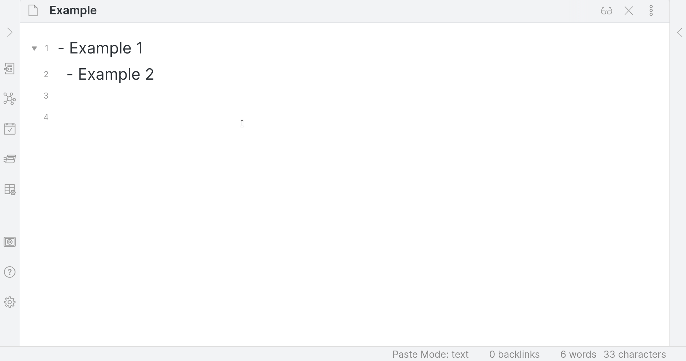
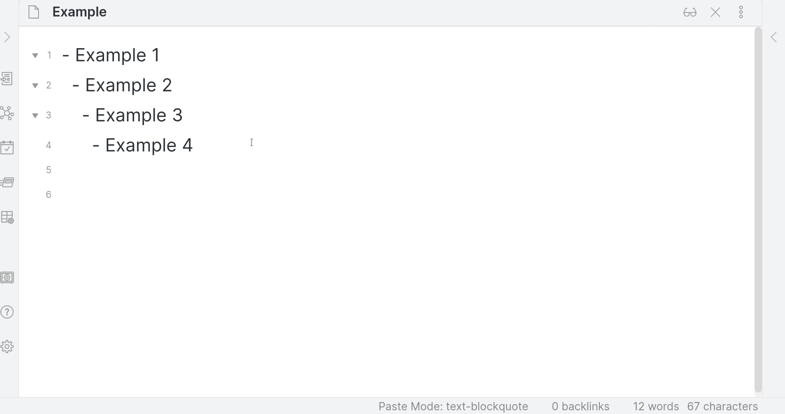

## Obsidian Paste to Current Indentation Plugin

_Note: Version 2.0.0+ is a rewrite of significant portions of this plugin and the way it works. If you were previously using a lower version, please be aware that Version 2 introduces the concept of "Paste Modes," explained below; and that it deprecates several Command Palette commands._

An [Obsidian](https://obsidian.md/) plugin to paste and manage text, including block quotes, that are indented. This plugin helps especially with embedding code, quotes, and other content within lists.

### "Paste modes"

Paste to Current Indentation takes over the paste functionality within Obsidian. It has six "paste modes," which determine what happens when one pastes text within a file in Obsidian. **All of the below will honor the cursor's current indentation when pasting, except for "Passthrough" mode, which uses Obsidian's default paste functionality.**

1. "Text" mode: Paste the clipboard text.
1. "Text Blockquote" mode: Paste the clipboard text as a blockquote (prepended with the prefix from the plugin's Settings menu -- by default, "`> `").
1. "Markdown" mode: Convert any HTML to markdown before pasting.
1. "Markdown Blockquote" mode: Convert any HTML to Markdown before pasting. Then, paste the result as a blockquote (prepended with the prefix from the plugin's Settings menu -- by default, "`> `").
1. "Passthrough" mode: Use Obsidian's default paste functionality.

The current paste mode is displayed in Obsidian's Status Bar:

### Switching paste mode

There are four ways to switch paste modes:

1. Clicking the status bar paste mode display will bring up a searchable menu with which you can select a new mode.
1. Open the Command Palette and search for `Paste to Current Indentation: Set Paste Mode`. One command per paste mode is provided.
  - These commands could be used, e.g., with the Obsidian [Quick Add plugin](https://github.com/chhoumann/quickadd/blob/master/docs/Choices/MacroChoice.md) to assign a keyboard command for switching to a given mode and then pasting.
1. Open the Command Palette and search for `Paste to Current Indentation: Cycle Paste Mode`. This command will cycle through the different paste modes (i.e., from Text mode to Text Blockquote mode, to Markdown mode, to Markdown Blockquote mode, to Passthrough mode, back to Text mode, etc.)
1. Within the plugin's Settings page.

### Additional commands

- Within the Command Palette, the `Paste to Current Indentation: Toggle blockquote at current indentation` command will toggle blockquote markers at the highlighted text's current level of indentation. 

Block quote markers are customizable via the plugin's Settings page (e.g., if you prefer to use spaces instead of `> `).

# Roadmap

I consider this plugin feature-complete for now.

Todo: 

- Add tests

# Developing for this plugin

The documentation below is retained from the [Obsidian Sample Plugin](https://github.com/obsidianmd/obsidian-sample-plugin).

## Quickstart guide for development

- Clone this repo to a local development folder. For convenience, you can place this folder in your `.obsidian/plugins/your-plugin-name` folder.
- Install NodeJS, then run `yarn` in the command line under your repo folder.
- Run `yarn dev` to compile your plugin from `main.ts` to `main.js`.
- Enable the plugin in Obsidian's Settings window.
- Make changes to `main.ts` (or create new `.ts` files). Those changes should be automatically compiled into `main.js`.
- Reload Obsidian to load the new version of the plugin.
- For updates to the Obsidian API run `yarn` in the command line under this repo's folder.

## Releasing new releases

- Update `manifest.json` with the new version number, such as `1.0.1`, and the minimum Obsidian version required for the latest release.
- Update the `versions.json` file with `"new-plugin-version": "minimum-obsidian-version"` so older versions of Obsidian can download an older version of the plugin that's compatible.
- Create new GitHub release using the new version number as the "Tag version". Use the exact version number (i.e., do not include a prefix `v`). See here for an example: https://github.com/obsidianmd/obsidian-sample-plugin/releases
- Upload the files `manifest.json`, `main.js`, and `styles.css` as binary attachments.
- Publish the release.

## Adding the plugin to the community plugin list

- Publish an initial version.
- Make sure you have a `README.md` file in the root of the repo.
- Make a pull request at https://github.com/obsidianmd/obsidian-releases to add the plugin.

## Manually installing the plugin

- Copy over `main.js`, `styles.css`, `manifest.json` to your vault `VaultFolder/.obsidian/plugins/obsidian-paste-to-current-indentation/`.

## Obsidian API documentation

See https://github.com/obsidianmd/obsidian-api
