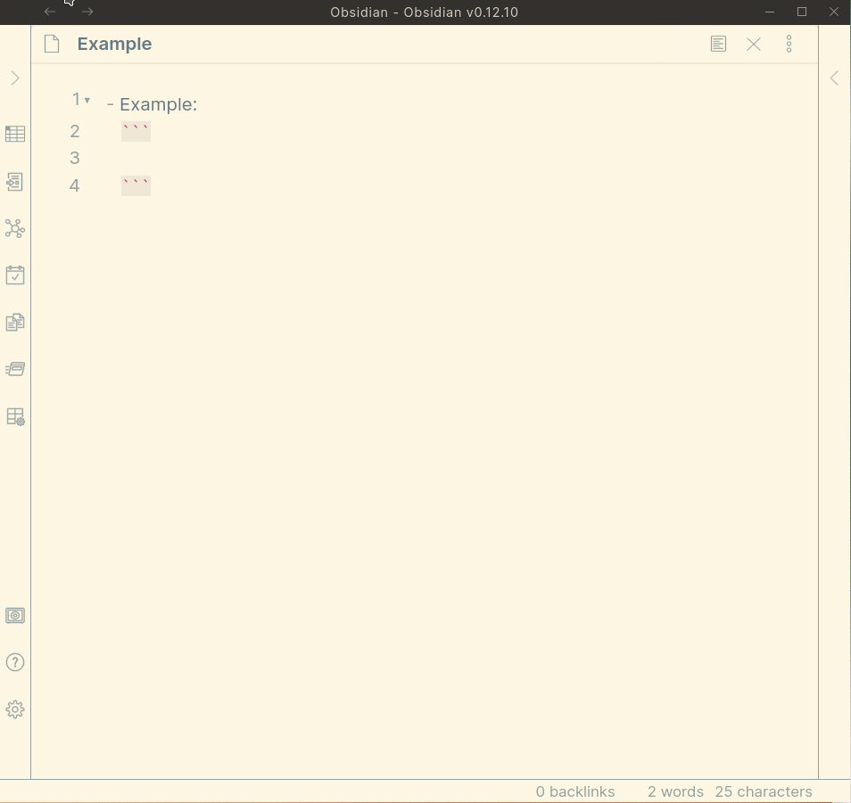
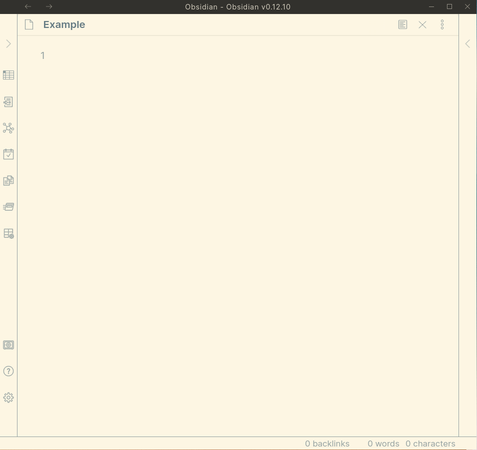
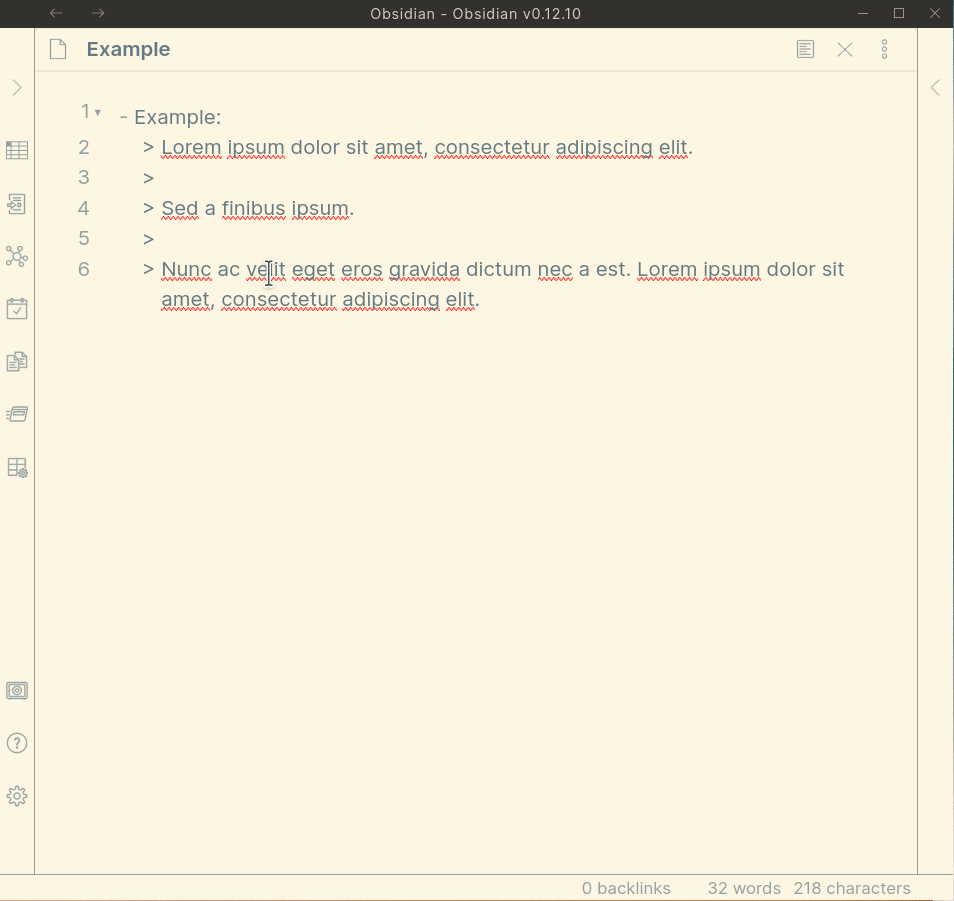
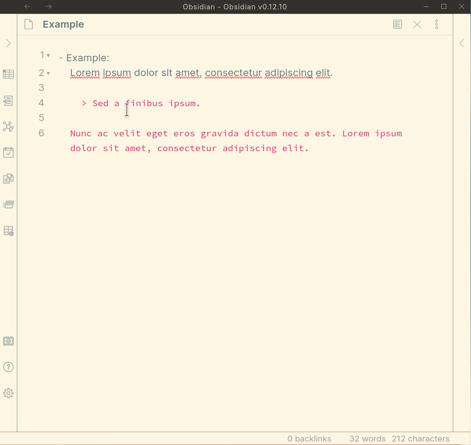
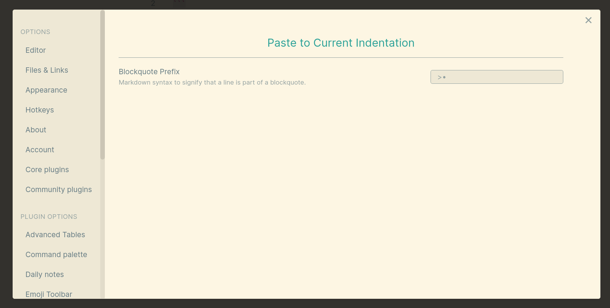

## Obsidian Paste to Current Indentation Plugin

An [Obsidian](https://obsidian.md/) plugin to paste and manage block quotes that are indented. This plugin helps especially with embedding code, quotes, and other content within lists.

The plugin can paste text as a block quote:

Block quote markers can be toggled on and off for indented text:

Block quote markers are customizable via a Settings tab (e.g., if you prefer to use spaces instead of `> `):

# Roadmap

I consider this plugin feature-complete for now.

Todo: 

- Add tests

# Developing this plugin

The documentation below is retained from the [Obsidian Sample Plugin](https://github.com/obsidianmd/obsidian-sample-plugin).

## Quickstart guide for development

- Clone this repo to a local development folder. For convenience, you can place this folder in your `.obsidian/plugins/your-plugin-name` folder.
- Install NodeJS, then run `npm i` in the command line under your repo folder.
- Run `npm run dev` to compile your plugin from `main.ts` to `main.js`.
- Make changes to `main.ts` (or create new `.ts` files). Those changes should be automatically compiled into `main.js`.
- Reload Obsidian to load the new version of the plugin.
- Enable plugin in settings window.
- For updates to the Obsidian API run `npm update` in the command line under this repo's folder.

## Releasing new releases

- Update `manifest.json` with the new version number, such as `1.0.1`, and the minimum Obsidian version required for the latest release.
- Update the `versions.json` file with `"new-plugin-version": "minimum-obsidian-version"` so older versions of Obsidian can download an older version of the plugin that's compatible.
- Create new GitHub release using the new version number as the "Tag version". Use the exact version number, don't include a prefix `v`. See here for an example: https://github.com/obsidianmd/obsidian-sample-plugin/releases
- Upload the files `manifest.json`, `main.js`, `styles.css` as binary attachments.
- Publish the release.

## Adding the plugin to the community plugin list

- Publish an initial version.
- Make sure you have a `README.md` file in the root of the repo.
- Make a pull request at https://github.com/obsidianmd/obsidian-releases to add the plugin.

## How to use when developing

- Clone this repo.
- `npm i` or `yarn` to install dependencies
- `npm run dev` to start compilation in watch mode.

## Manually installing the plugin

- Copy over `main.js`, `styles.css`, `manifest.json` to your vault `VaultFolder/.obsidian/plugins/your-plugin-id/`.

## API Documentation

See https://github.com/obsidianmd/obsidian-api
