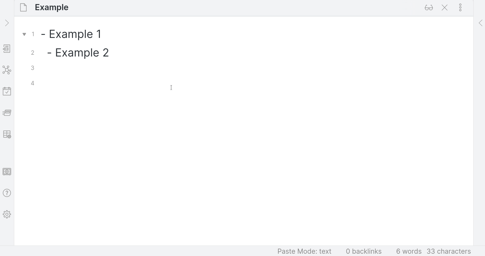
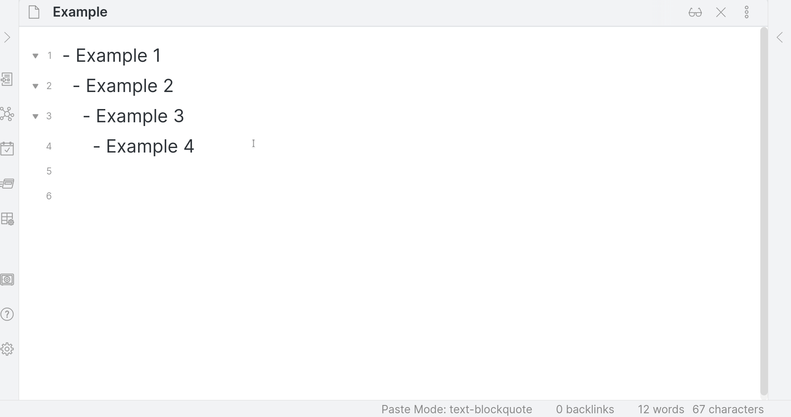
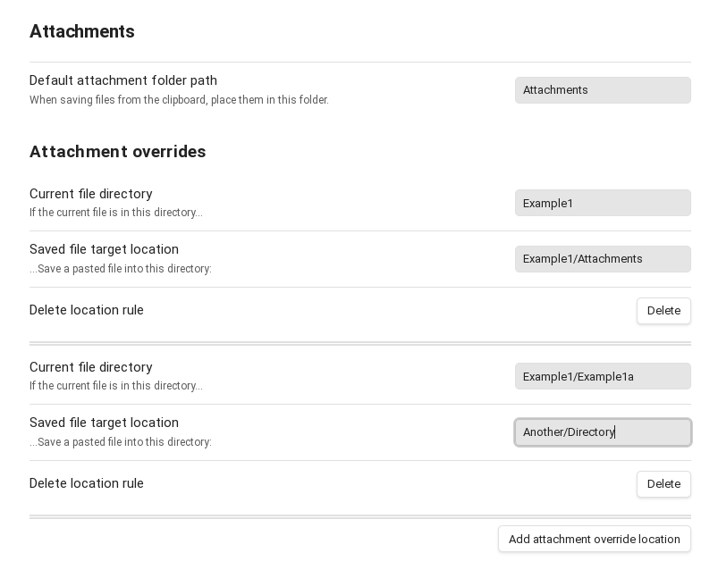

## Extended Paste Mode

An [Obsidian](https://obsidian.md/) plugin to paste and manage text, including block quotes, at any level of indentation.

### Paste modes

Paste Mode takes over paste functionality within Obsidian. It has seven paste modes, which determine what happens when pasting text within a file. **All modes honor the cursor's current indentation when pasting, except "Passthrough" mode, which uses Obsidian's default paste behavior.**



1. **Text** — Paste clipboard text as-is.
1. **Text (Blockquote)** — Paste with blockquote prefix (default `> `, configurable).
1. **Markdown** — Convert HTML to Markdown before pasting.
1. **Markdown (Blockquote)** — Convert HTML to Markdown, then wrap in blockquote.
1. **Code Block** — Paste within ` ``` ` code fences.
1. **Code Block (Blockquote)** — Paste within code fences, then wrap in blockquote.
1. **Passthrough** — Use Obsidian's default paste behavior.


#### Switching modes

1. Click the status bar indicator to open a searchable mode picker.
1. `Paste Mode: Cycle Paste Mode` in the Command Palette cycles through all modes.
1. `Paste Mode: Set Paste Mode to <mode>` commands for direct switching (bindable via, e.g., Quick Add).
1. Plugin settings tab.

#### Limitations

- In Obsidian Mobile, "Markdown" and "Markdown (Blockquote)" one-time paste commands are disabled due to clipboard API restrictions.
- Similarly, images/screenshots cannot be pasted from the clipboard on mobile.

### Additional commands

- **`Paste Mode: Toggle blockquote at current indentation`** — toggles blockquote markers on the selected text.  
  

### Additional features

- **Dynamic attachment saving** — route pasted files to different folders based on the current note's location.  
  
- **Download linked files** — when pasting Markdown, files referenced via `http://` or `file://` URLs can be downloaded locally.
- **Automatic character escaping** — escape Markdown-sensitive characters (`==`, `<`, etc.) in blockquotes.

### Developing

```bash
npm install
npm run dev    # watch mode
npm run build  # production build
```

### Releasing

1. Update `manifest.json` and `versions.json` with the new version.
2. Create a GitHub release tagged with the version number (no `v` prefix).
3. Upload `main.js`, `manifest.json`, `styles.css` as binary attachments.

## Additional contributor acknowledgements

This plugin is substantially better for the contributions of Jason Shelter, who authored a substantial update in 2026.
